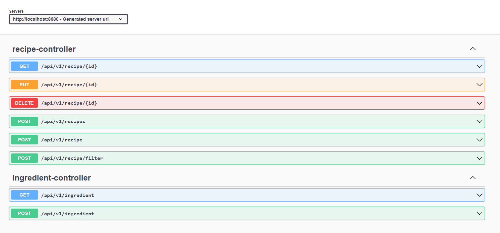

# RecipeService

Web service which allows users to manage their favourite recipes.

Below is swagger for rest api's available
http://localhost:8080/swagger-ui/index.html

# Prerequisite
You must have docker installed on local system. Since I am using MySQL test container to run integration test, docker must be installed locally.

#How to run the application
You can clone this project to get started
https://github.com/rishabgo/RecipeService.git

After downloading start application by running RecipeServiceApplication.java

Postman collection: Recipe-Service.postman_collection.json

#Architectural decision:
1) For rest API creation, I decided to go with SpringBootRest API.
2) For Database, I used In memory H2 Database. Since relational db can easily model the data. The structure of business data is very clear and the relationship between different entities(recipe, ingredient) is stable.
3) To dynamically create different queries, I used Spring data JPA Criteria API.
4) For Integration test I used test container for Mysql db running as container.

